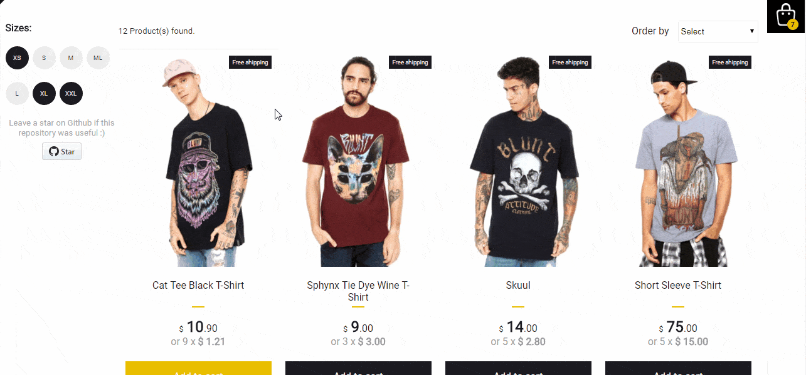

## Title: This Online-Shopping-Cart application when built has the following features.  

  

## Basic Overview - [Live Demo](https://react-shopping-cart-67954.firebaseapp.com/)

This simple shopping cart prototype shows how React components and Redux can be used to build a
friendly user experience with instant visual updates and scaleable code in ecommerce applications.

  #### Features

- Add and remove products from the floating cart
- Sort products by highest to lowest and lowest to highest price
- Filter products by available sizes
- Products persist in floating cart after page reloads
- Unit tests, integration tests, api tests and e2e testing
- Responsive design

## Pre-requisites: Below are the system requirements to build this project.
 #### Install below
 - This app has been tested working in node version v10.1.0.
    - Download and install node version 10.1.X
    - Check node version with node -v to confirm the installed version.
    - Also, be sure to have `git` available in your PATH, `npm` might need it

Note: If any of the npm installs fails with permission error, try running with 'sudo' permission, e.g, sudo npm install
## To build the application, some node modules are required. 
 #### First, Install the needed packages, run the below command, this takes all the required packages from package.json file located in project root folder*/

Run command: npm install

## After all the required packages are installed successfully. Start both Node and React with the below command. This will start the application at port: 3000 with url: http://localhost:3000/ 

Run command: npm start

# Running tests

#### Unit and Integration tests

###### To run unit and integration tests, run the below command. All components have at least a basic smoke test. Integration test includes fetch product and add to cart properly.

Run command: npm run test

#### Istanbul code coverage test.
About Istanbul: Istanbul instruments your ES5 and ES2015+ JavaScript code with line counters, so that you can track how well your unit-tests exercise your codebase. The report will tell you whether your unit tests cover all parts of the code.

Run command: npm run test:coverage

#### Stryker  mutation testing. How effective are the unit tests, that can be evaluated by running mutation tests with Stryker. 

Run below to run stryker on the unit tests
- Install stryker: npm install -g stryker-cli

Run command: npm run stryker

- Stryker reports can be found at ./reports/mutation/html/index.html

How Stryker works: Bugs, or mutants, are automatically inserted into your production code. Your tests are ran for each mutant. If your tests fail then the mutant is killed. If your tests passed, the mutant survived. The higher the percentage of mutants killed, the more effective your tests are.

#### Lighthouse web page performance testing.
It gathers webpage metrics like page performance, accessibility, the best practices, search engine optimization etc. and displays in variety of formats like html, json.

- Install lighthouse : npm install -g lighthouse-ci

Run command: npm run lighthouse

#### Artillery load testing. 
How your application behaves under certain user load. Artilery can be used as part of in-sprint load testing. Test scripts can be written in YAML or JSON. 

- Install Artillery : npm install -g artillery

Note: If the installation fails with some npm ERR! code EACCES, try appending --allow-root --unsafe-perm=true e.g. sudo npm install -g artillery --allow-root --unsafe-perm=true

Run command: npm run artillery

This runs a art-test.yml file which defines one load phase, which will last 30 seconds with 10 new virtual users (arriving every second (on average). Then we define one possible scenario for every new virtual user to pick from, which consists of one GET request.

Report can be found at: ./Artillery/Report

How to read report:

•	Scenarios launched is the number of virtual users created in the preceding 10 seconds (or in total).

•	Scenarios completed is the number of virtual users that completed their scenarios in the preceding 10 seconds (or in the whole test). Note: this is the number of completed sessions, not the number of sessions started and completed in a 10 second interval.

•	Requests completed is the number of HTTP requests and responses or WebSocket messages sent.

•	RPS sent is the average number of requests per second completed in the preceding 10 seconds (or throughout the test).

•	Request latency is in milliseconds, and p95 and p99 values are the 95th and 99th percentile values (a request latency p99 value of 500ms means that 99 out of 100 requests took 500ms or less to complete).

•	Codes provides the breakdown of HTTP response codes received.

If you see NaN ("not a number") reported as a value, that means not enough responses have been received to calculate the percentile.

#### Clinic.js Doctor for Nodejs performance profiling.

Clinic doctor is a performance profiling tool. Doctor helps diagnose performance issues in your application and guides you towards more specialised tools to look deeper into your specific issues. Symptoms such as low CPU usage, blocking garbage collection, frequent event loop delay or a chaotic number of active handles may indicate a number of potential problems.
We need  to apply load to the server to see how it performs when handling many requests. We will use a benchmarking tool called Autocannon.
To load-test the server, we want to run it with Doctor, and point autocannon at it as soon as it starts listening on a port. This will bombard the server with requests, as soon as it is ready to handle them and Doctor is ready to collect data.

- Install clinic: npm install -g clinic
- Install benchmarking tool Autocannon : npm install -g autocannon

 Run command: run clinic doctor --autocannon [ / ] -- node ./server/app.js

-Reports are created under ./clinic folder
  <table>  
  <tr>
    <td align="center"> looks like this</img></td>
 </tr>
 </table>

How to read the report:
The report shows the CPU usage, memory usage, Event loop delay and active handles in graphical format. These plot various variables used in Doctor's analysis over time, from the start time of the profile (left end of the X-axis) to the finish time (right end of the X-axis).

-- You can utilize any other tool to benchmark your application. As we already have a artillery script to load test our app. we can use it in place of autocannon like below.

 Run command: clinic doctor --on-port 'npm run artillery' -- node server/app
 Run command(for I/O issues): clinic bubbleprof --on-port 'npm run artillery' -- node server/app 

#### E2E TESTS

###### We have used 'testcafe' to run e2e tests. Run below command to run end to end tests. It uses the .testcaferc.json file in the project root folder to fetch testcafe runtime configuration

npm run test:TestCafe 

 ##### Test scenarios: Following functionalities have been tested as part of e2e testing
- Add and remove products from the floating cart
- Sort products by highest to lowest and lowest to highest price
- Filter products by available sizes
- Products persist in floating cart after page reloads

Test report(using HTML reporter) can be found : ./e2e/cafe/reports/tc_report.html 
To open the report, browse to the folder and open the report in any HTML browser like chrome/Safari

#### API TESTS

###### We have used SuperTest/Mocha to do the api testing. Run the below command to execute the 
npm run test:SuperTest
##### Test scenarios: Following functionalities have been tested as part of api testing
As this api only returns all the products in the db/xml. There is no operation defined on the api. The scope of testing was limited.
-  Validate the api responds with 200 status code.
-  Count the api returns all the products available
-  Validate all the products returned with all the fields/tags required in the UI

API test results can be found at : ./APITestResult

